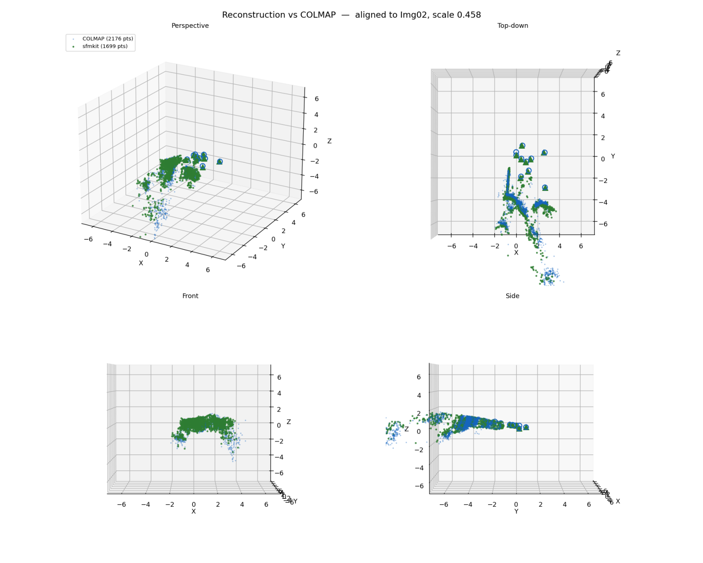
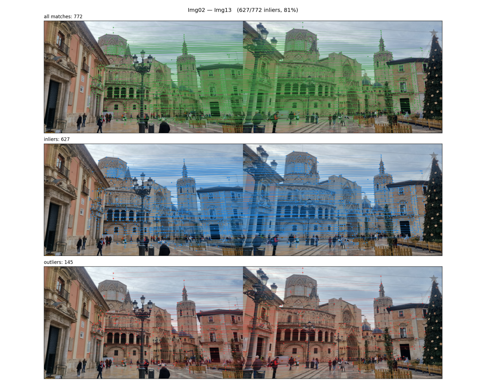
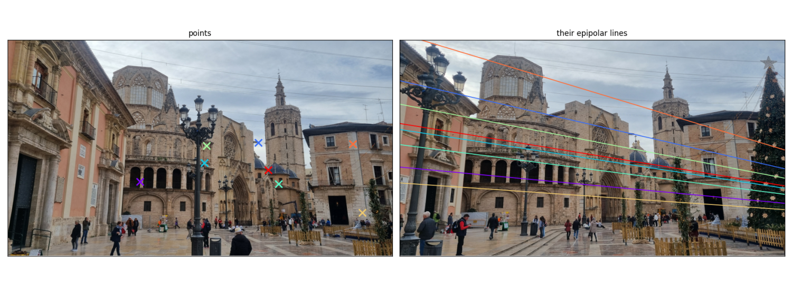
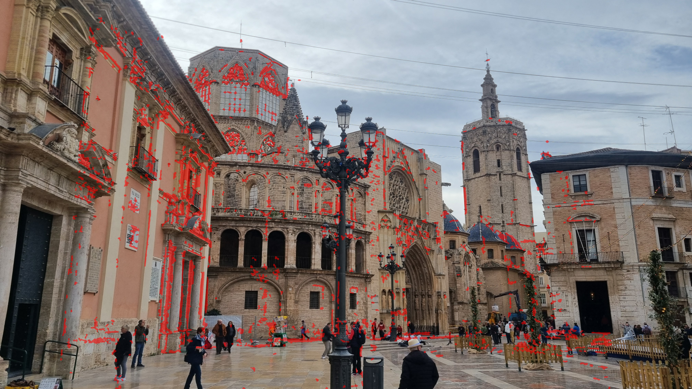

# sfmkit — Structure from Motion, and a cathedral

A small, tested Structure-from-Motion library, and the case study it was built
for: recovering the viewpoint of an undated historical photograph of the
Cathedral of Valencia by reconstructing the square from modern phone pictures
and localising the old photograph inside that reconstruction.

The reconstruction is validated against COLMAP throughout.



*Nine cameras and 1699 points (green) against COLMAP's model of the same images
(blue), aligned to a common reference and scale.*

---

## What this is

Two things, deliberately separated:

* **`src/sfmkit/`** — a general SfM library. Two-view geometry, robust
  estimation, feature tracks, incremental reconstruction, bundle adjustment,
  visual localisation. Pure functions over numpy arrays; no file paths, no
  global state, no plotting. It knows nothing about Valencia.
* **`apps/` (the `sfmkit` CLI and TUI), `data/` and `configs/`** — the case
  study. Three folders with the same shape:

  ```
  data/valencia/      raw inputs, read-only: scene/ photos (+ precomputed/ stand-ins)
  configs/valencia/   one YAML per experiment: which images each stage uses
  runs/valencia/      one folder per config, one subfolder per stage
  ```

  Intrinsics and the COLMAP reference are stages of the run, not fixed data, so
  each experiment can compute them from its own images. Until the chessboard
  photos and COLMAP are wired in, both stages copy a precomputed result from
  `data/valencia/precomputed/`.

The split is not cosmetic. It is what lets the whole library be tested on
synthetic scenes with exact ground truth, in seconds, with no dataset present.

## Results

Nine modern photographs (Samsung SM-G996B, 4032×2268), calibrated with OpenCV,
matched with SuperPoint + LightGlue, reconstructed and compared against a COLMAP
model of the same images.

### Camera poses vs COLMAP

37 pairs matched in 3 s on an RTX 4090, verified in 2 s, reconstructed in ~2 min.

| camera | rotation error | position error | distance from reference |
|---|---|---|---|
| Img13 | 0.34° | 0.064 | 0.53 |
| Img25 | 0.37° | 0.079 | 1.00 |
| Img14 | 1.26° | 0.078 | 1.04 |
| Img24 | 0.54° | 0.106 | 1.29 |
| Img23 | 1.65° | 0.109 | 1.79 |
| Img15 | 0.30° | 0.134 | 2.08 |
| Img28 | 0.55° | 0.089 | 2.47 |
| Img12 | 2.84° | 0.133 | 3.86 |

**Mean 0.98°, max 2.84°**, over nine cameras and 1699 points. The recovered scale
against COLMAP is **0.458**.

Against the original course pipeline on the same nine images:

| | original | sfmkit |
|---|---|---|
| cameras | 9 | 9 |
| 3D points | 1041 | **1699** |
| mean rotation error | 0.962° | 0.981° |
| max rotation error | 2.769° | 2.835° |
| reproducible | no | yes |

Equivalent accuracy on 63% more points — and, unlike the original, the same
inputs now give the same outputs.

`Img12`, the most distant camera, remains the weakest at 2.84°. Re-running PnP
for every camera after the global refinement was tried and made things slightly
worse (0.981° to 1.001°); the result is recorded in
[docs/optimizations.md](docs/optimizations.md) rather than kept behind a flag.

These three thresholds (`pnp_threshold`, `min_triangulation_angle_deg`,
`max_reprojection_error`) were chosen by the grid search in `scripts/sweep.py`,
scored against COLMAP. Two of its results are counter-intuitive and worth
knowing: a *tighter* reprojection threshold makes things worse, because it
discards points a later bundle adjustment would have pulled into line, and a
*larger* minimum triangulation angle registers *more* cameras, by refusing
badly conditioned points that would otherwise corrupt the PnP depending on
them.

### Localising the historical photograph

The old plate is 557×418; the modern images are 4032×2268 with *f* = 3544 px.
Its intrinsics are therefore estimated rather than assumed, by fitting a full
projection matrix (DLT) and decomposing it:

| | focal length |
|---|---|
| COLMAP's estimate for this image | 597.8 px |
| **sfmkit, over 30 seeds** | **632–650 px** |
| the original pipeline's saved `K_old` | f<sub>x</sub> = 27139, f<sub>y</sub> = 7054 |

Over 30 seeds the estimated camera centre moves by 0.27 in a scene 3.9 across,
and the reprojection RMSE ranges from 2.1 to 20.0 px (median 2.2). Reporting one
of those numbers alone would be a coin flip presented as a measurement — the
original pipeline drew from exactly this distribution, unseeded, once.

Within 8% of COLMAP. The original's value has a 3.8:1 aspect ratio and no
physical meaning, which is what the presentation was seeing when it reported the
old camera as "rotated a little bit weird".

Rotation error against COLMAP is 12.8–15.6° over 30 seeds (median 14.4°), and it
is reported as that range rather than as one number — see below.

### Star graph vs complete graph

Same code, same thresholds, same seed; the only difference is which pairs the
reconstruction may use. This was the headline hypothesis of the rewrite, and
**the measurement largely refutes it**:

| | star (8 pairs) | complete (36 pairs) |
|---|---|---|
| tracks | 1185 | **2104** |
| observations | 4367 | **6928** |
| cameras registered | 8 | **9** |
| 3D points | 915 | **1404** |
| mean rotation error | **0.754°** | 1.603° |

But averaged over the seven cameras *both* reconstruct, the two agree to within
6% (0.754° vs 0.804°). The complete graph's worse headline is entirely `Img12`,
the extra camera it registers badly. It buys **reach, not accuracy**: 78% more
tracks, 53% more points, one more camera.

The reasoning behind the hypothesis was sound and its supporting evidence was
real. It was still wrong, and [docs/optimizations.md](docs/optimizations.md#4-the-star-shaped-pose-graph--hypothesis-tested-largely-refuted)
keeps the full account.

## Quick start

```bash
pip install -e ".[dev]"
pytest                                  # 115 tests, no dataset required
```

The whole pipeline:

```bash
sfmkit run --config configs/valencia/all9.yaml     # writes runs/valencia/all9/
```

Or a stage at a time — `calibrate`, `match`, `verify`, `reconstruct`,
`localize`, `colmap`, `evaluate`, `changes`, `figures`:

```bash
sfmkit reconstruct --config configs/valencia/all9.yaml
```

`--out` overrides the run directory. `$SFMKIT_DATA` and `$SFMKIT_RUNS` move the
data and runs roots (default `data/` and `runs/` in the working directory).

`sfmkit run` also takes `--from <stage>`, `--only a,b` and `--skip-done`. Only
`match` needs a GPU; everything downstream runs on numpy.

A terminal interface for browsing, comparing and launching runs:

```bash
sfmkit ui                               # needs pip install 'sfmkit[tui]'
```

### Diagnostics

`sfmkit figures` also renders the per-stage diagnostics: what the matcher
produced and what geometric verification kept, the epipolar geometry it implies,
and where the reconstruction projects against where the keypoints actually are.



*`Img02`–`Img13`: 772 matches, 627 inliers (81%), 145 outliers. The rejected
matches are not random — they concentrate in the sky and on the repeated
arcades, which is the signature of repeated structure rather than of a failing
matcher.*



The "before and after bundle adjustment" pair compares two reconstructions that
genuinely existed: the state saved just before the final global refinement, and
the state after it. Expect the difference to be small — by that point eight
incremental bundle adjustments have already run, and most of the correction has
been made.

### Change detection



*Structural differences between the historical plate and a modern photograph,
after homography alignment.*

A homography aligns a plane exactly and nothing else. The cathedral facade is
near enough to planar; the buildings flanking the square are at very different
depths and register poorly, so much of what is flagged there is misalignment
rather than change. That is a limitation of the method, not a defect in the
implementation, and the honest reading of the figure is "the facade is
comparable, the rest is not".

## Container

⚠️ **The `Dockerfile` has not been built or tested** — it was written on a
machine without Docker. Treat it as a starting point that needs one
`docker build` before being trusted.

```bash
docker build -t sfmkit .
docker compose run --rm sfmkit reconstruct --config configs/valencia/all9.yaml
```

The dependency that justifies containerising this project is COLMAP: a system
binary with an unpleasant dependency tree, without which the reference model
cannot be regenerated. Python dependencies alone would be adequately served by a
lockfile.

The build is multi-stage so that build tooling does not reach the runtime image,
and layers are ordered by change frequency so editing a source file does not
reinstall PyTorch. Images and run outputs are mounted, never baked in.

## Design notes

**Every stage reads an explicit input directory and writes an explicit output
directory, and every output carries a manifest** recording the config, the git
commit and the package versions that produced it. This is the contract whose
absence is the main lesson of the project's first version (see
[docs/optimizations.md](docs/optimizations.md)).

**Randomness is always a parameter.** There is no implicit global RNG anywhere
in the library. `sfmkit localize` runs many seeds by default and reports the
pose as a distribution, because a single number from a RANSAC would be a
coin flip presented as a measurement.

**Conventions are fixed once**: points are row-major `(N, 3)` and `(N, 2)`,
poses are world-to-camera as in COLMAP, and nothing in the library performs I/O.

## Learning the library

[docs/tour.md](docs/tour.md) is a guided tour: paste the blocks into a Python
session in order and each builds on the last, from a single `Pose` to a full
reconstruction checked against known ground truth. It needs no photographs, no
GPU and no dataset, because it runs on synthetic scenes whose answer is known by
construction.

Every block in it is executed by `tests/test_tour.py`, so it cannot drift away
from the API without the suite failing.

## Testing

```
tests/test_geometry.py      invariants + known answers + OpenCV as an oracle
tests/test_tracks.py        union-find, conflict rejection, ground-truth tracks
tests/test_robust.py        seeding, determinism, degenerate inputs
tests/test_bundle.py        packing, gauge, sparsity coverage, robust loss
tests/test_reconstruct.py   end-to-end against a synthetic scene
tests/test_localize.py      DLT with unknown intrinsics, correspondence lifting
tests/test_changes.py       homography alignment, invariance to exposure
tests/test_tui_model.py     run discovery and diffing, without a terminal
```

The approach worth stealing is `sfmkit.synthetic`: generate cameras and 3D
points, project them, feed the projections back through the pipeline, and assert
against the exact answer. It needs no data, runs in CI, and makes otherwise
awkward things testable — track construction, for instance, because the
generator knows which keypoints across which images are the same 3D point.

Beyond correctness, the suite pins down properties that are easy to lose:
rotations stay orthonormal, fundamental matrices stay rank 2, the declared
Jacobian sparsity pattern really does cover every nonzero, the gauge stays fixed,
and multi-view triangulation genuinely beats two-view under noise.

## History

This repository is a rewrite. The original was a set of scripts written for a
computer-vision course; it produced good geometry and no reproducibility, and
by the time it was revisited it could not be re-run at all.

[docs/optimizations.md](docs/optimizations.md) is the record of taking it apart:
what was measured, what was fixed, and — kept deliberately — the hypotheses that
were plausible, carefully argued, and wrong. The performance investigation in
particular took three wrong diagnoses before the profiler settled it, and the
wrong turns are more instructive than the answer.

## Licence

MIT.
