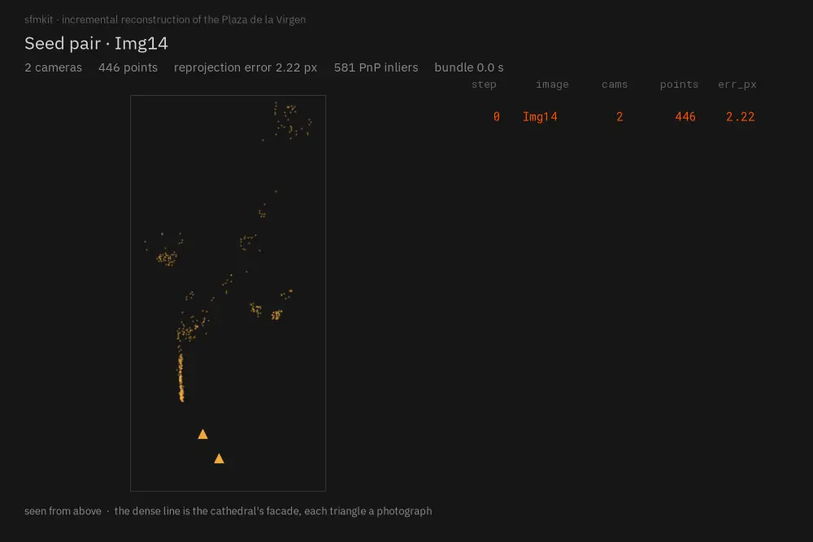
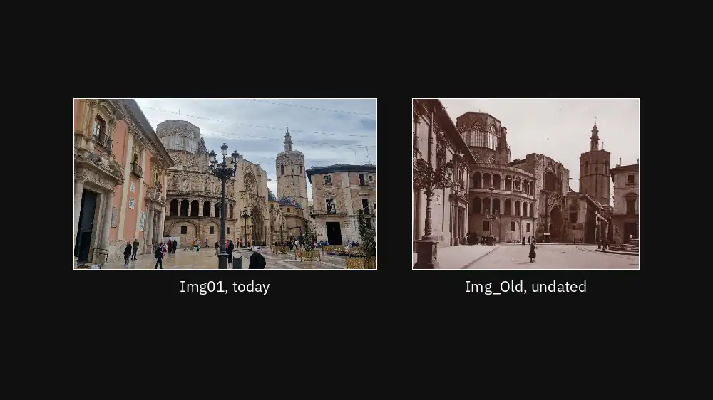
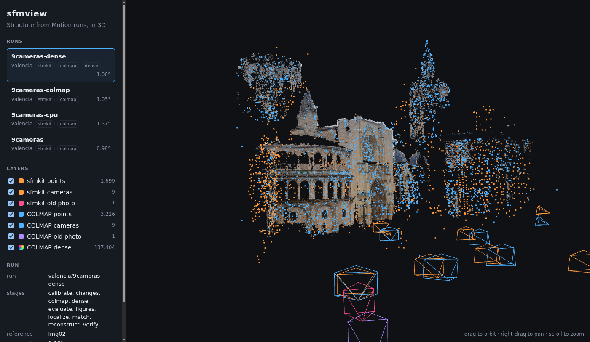
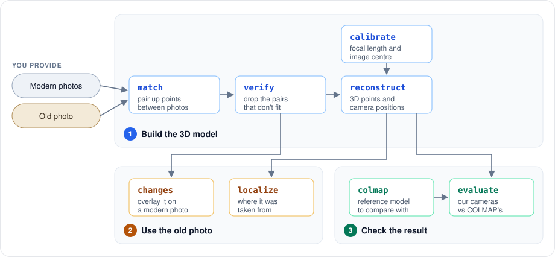
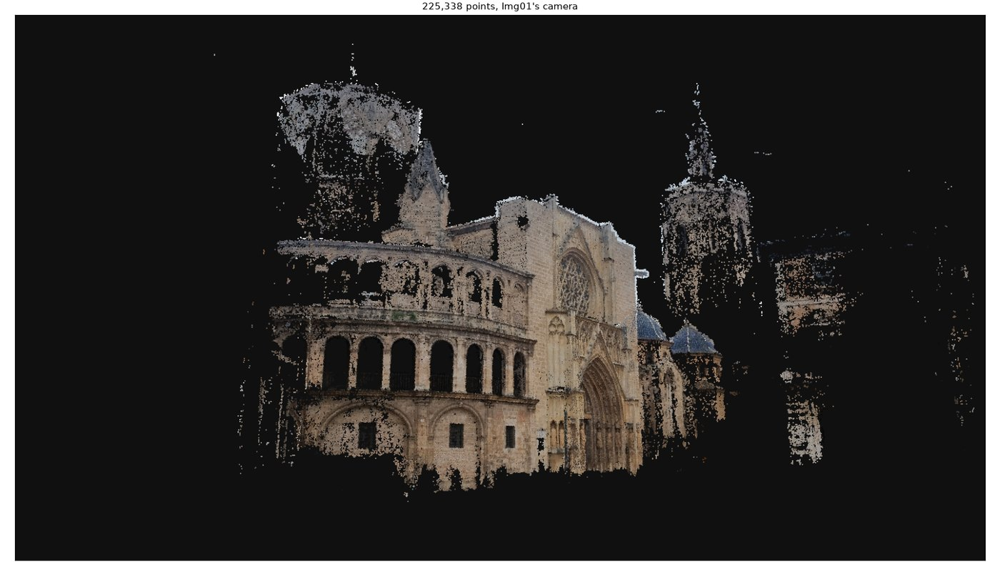

# sfmkit

[](https://github.com/dpadillaor/sfmkit/actions/workflows/ci.yml)
[](https://dpadillaor.github.io/sfmkit/)
[](LICENSE)

sfmkit is a Structure-from-Motion library written from the geometry up: two-view
geometry, feature tracks, incremental reconstruction, and a bundle adjustment of
its own. Every result it reports is scored against
[COLMAP](https://colmap.github.io/).

It was built to answer one question. Give it a handful of photographs of a place
and one undated photograph of the same place, and it works out where the old one
was taken from — then shows you, on today's photograph, what is no longer there.

The library is open source and takes any set of photographs — `sfmkit new` lays a
project of your own out beside this one. The set that ships with it was
photographed for it: fourteen frames of the Plaza de la Virgen in Valencia, one
phone, fourteen minutes of one December morning, and one undated print of the
same square whose photographer and camera are unknown.


*What it is given. The undated photograph is matched against `Img01` alone and
kept out of the model; the thirteen underneath are what build it.*

**[Documentation](https://dpadillaor.github.io/sfmkit/)** ·
[Tutorial](https://dpadillaor.github.io/sfmkit/tutorial/) ·
[Results](https://dpadillaor.github.io/sfmkit/project/results/) ·
[The viewer](https://dpadillaor.github.io/sfmkit/viewer/)

## The map, built



*Fourteen photographs of the square becoming a model of it. Two cameras to start,
then one at a time — each placed against the points already there, each followed
by a bundle adjustment — and a global refinement over everything at the end. The
table keeps the count, and the reprojection error after every step.*

The bundle adjustment is ours: Levenberg–Marquardt, an analytic Jacobian, the
points eliminated with the Schur complement. It replaced
`scipy.optimize.least_squares`, which on these problems never converged — it
exhausted its evaluation budget on every bundle. Ours is **58× faster and reaches
a lower cost**, which is what turned a run from minutes into seconds and made
searching the thresholds affordable at all.
[The numbers](https://dpadillaor.github.io/sfmkit/project/results/#the-bundle-adjustment).

## How far off it is

Fourteen cameras, 2 830 points, and a **mean rotation error of 0.30°** against
COLMAP.

That number is worth quoting because of what it is measured against: COLMAP run
from scratch on the same photographs, with its own features and its own matching.
The two programs share the photographs and nothing else. Scored instead against a
model that had been fed matches like ours, the same reconstruction reads 0.379°.

Matching runs where `sfm.device` says, and a CPU and a GPU do not find quite the
same matches, so they do not give quite the same model: 2 850 points at 0.338° on
a CPU, 2 830 at 0.300° on a GPU. Both configs ship with the repository.

## The old photograph

This is the part the rest exists for. It was taken by another camera, of unknown
focal length, perhaps cropped, a century before the others, so it cannot simply
join the reconstruction: it is matched against one modern photograph only, kept
out of the model so that a poorly constrained camera cannot bend it, and then
**placed against the finished model** — solving for its whole projection matrix,
focal length included, because assuming the phone's would put it somewhere else
entirely. RANSAC-DLT on eleven unknowns, then refined in pixels under a Huber
loss, which took its reprojection from 14 px to 2 and stopped it landing
somewhere different on every seed.

Once it is placed, the two views can be brought together and their tones compared:



*The old photograph flown onto today's through the homography between them. The
facade lines up; what does not line up is what changed — the lamp posts have
moved, a building beside the cathedral is gone, the arcade now opens onto a
courtyard, and there are people in both photographs but never in the same place.*

And the answer can be argued with. For a long time our placement and COLMAP's
disagreed by 11.5°, and it turned out to be COLMAP that was wrong — the whole
argument, with the two measurements that settled it, is in
[Results](https://dpadillaor.github.io/sfmkit/project/results/#the-115-argument).

## The viewer, and the three services behind it



`sfmview` draws a run in 3D: our reconstruction in amber, COLMAP's in blue, both
in one frame so that what you see is what was scored, the old photograph among
them, and COLMAP's dense cloud. Click a camera to look through it.

It also draws a run **as it is being built**, and that is what the three services
in `compose.yaml` are for: the pipeline publishes each stage, and each camera it
registers, to a Redis stream; the viewer relays that to the page over a
WebSocket, and a timeline rewinds it.

```
cli ──▶ redis ──▶ viewer ──▶ browser
      (stream)          (websocket)
```

Neither program imports the other. They share a
[message format](https://dpadillaor.github.io/sfmkit/viewer/live/), written down
in AsyncAPI and checked against a schema on both sides, and a
[set of files](https://dpadillaor.github.io/sfmkit/viewer/), and nothing else —
which is enforced by a test that fails if the viewer's environment can so much as
import sfmkit. Each package builds its own image, and CI publishes them to GHCR
and to Docker Hub on a release.

## Try it

No COLMAP, no GPU, about half an hour on a laptop. The photographs come with the
repository, and this config scores the result against a COLMAP model saved here,
so nothing else has to be installed:

```bash
git clone https://github.com/dpadillaor/sfmkit && cd sfmkit
conda create -n sfmkit python=3.11 -y && conda activate sfmkit
pip install --no-deps -r packages/sfmkit/requirements-cpu.txt
pip install --no-deps -e packages/contracts -e packages/sfmkit

sfmkit run --config projects/valencia/configs/no-colmap.yaml
```

With Docker instead, and nothing on the host. The image carries COLMAP, so this
one runs it from scratch and scores against a model it computed itself:

```bash
make env                                                     # your uid, once
docker compose run --rm cli run --config projects/valencia/configs/cpu.yaml
docker compose up -d viewer                                  # http://127.0.0.1:8000
```

Photographs of your own take one more command, which lays out a project of theirs
and writes it a config:

```bash
sfmkit new plaza --photos ~/Pictures/plaza
sfmkit run --config projects/plaza/configs/cpu.yaml
```

The [tutorial](https://dpadillaor.github.io/sfmkit/tutorial/) walks through all of
it, and [Install](https://dpadillaor.github.io/sfmkit/install/conda/) through the
viewer's environment and the images.

## The pipeline

Ten stages, each a command; `sfmkit run` does them in order, and walks past any
the config does not ask for.



| Stage | What it does | On Valencia |
|---|---|---|
| `calibrate` | The camera's focal length and image centre, without which nothing can be measured | from the photographs' EXIF |
| `match` | Distinctive points in each photograph, paired between photographs | 92 pairs |
| `verify` | Throws away pairings that do not fit the geometry of two views | 86 pairs kept |
| `reconstruct` | Builds the 3D model: two photographs to start, then one at a time | 14 cameras, 2 830 points |
| **`localize`** | **Places the old photograph in that model** | **2 px reprojection, 0.60° from COLMAP's** |
| `colmap` | COLMAP's model of the same photographs, to be scored against | 14 cameras and the old one |
| `dense` | Optional, needs an NVIDIA GPU: a dense cloud from COLMAP's model | 226 792 points |
| `evaluate` | How far every camera is from COLMAP's | 0.30° mean rotation error |
| **`changes`** | **Overlays the old photograph on a modern one and marks what differs** | **7.6% of the overlap** |
| `figures` | The plots for a finished run | |

Every stage writes a manifest with the commit, the versions and the whole config,
so a figure can name the code that produced it.

## What is inside

Besides the bundle adjustment and the estimated camera above:

- **Three packages that do not know each other** — `packages/sfmkit` in four
  layers (`apps → render → data → core`), `packages/viewer` in ports and
  adapters, and `packages/contracts` underneath both, importing nothing but the
  standard library. All enforced by import-linter rather than by good intentions.
- **A project is one folder** — its photographs, its configs, its runs. A config
  is found by where it sits, so nothing names the project twice and the same file
  works on the host and inside a container.
- **Everything pinned, installed with `--no-deps`** — one list per environment,
  the same in conda and in Docker, so what CI proves is what the instructions
  give you. `pip check` guards the pins and has caught three real mismatches.
- **A frozen run, tracked** — what the regression measures against. CI reruns the
  pipeline on it and fails unless fourteen cameras come back within 0.02° of the
  error recorded here.



## Documentation

| | |
|---|---|
| [Tutorial](https://dpadillaor.github.io/sfmkit/tutorial/) | from a clone to a reconstruction in the viewer, then your own photographs |
| [Install](https://dpadillaor.github.io/sfmkit/install/conda/) | conda, or [Docker](https://dpadillaor.github.io/sfmkit/install/docker/) |
| [CLI reference](https://dpadillaor.github.io/sfmkit/guide/cli/) | every command, with [the configuration](https://dpadillaor.github.io/sfmkit/guide/config/) that drives it |
| [The viewer](https://dpadillaor.github.io/sfmkit/viewer/) | using it, its [HTTP API](https://dpadillaor.github.io/sfmkit/viewer/api/) and its [live messages](https://dpadillaor.github.io/sfmkit/viewer/live/) |
| [Results](https://dpadillaor.github.io/sfmkit/project/results/) | the numbers, and the arguments behind them |
| [Questions](https://dpadillaor.github.io/sfmkit/faq/) | COLMAP, GPUs, the weights, and why the old photograph is handled apart |

Everything explained is on the site. The READMEs left in the repository sit
beside what they describe — the photographs, and the scripts that draw the
figures — and explain nothing that is not there.

## Licence

MIT, in [LICENSE](LICENSE). The photographs, the feature weights it downloads and
the tools it calls are not ours to license: [NOTICE](NOTICE) says what each one
is.
