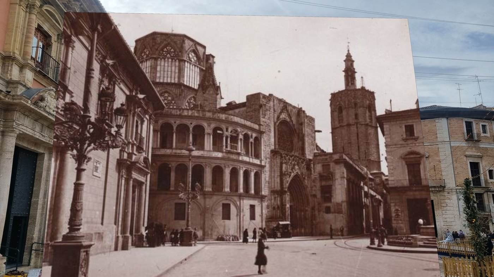

# sfmkit

[](https://github.com/dpadillaor/sfmkit/actions/workflows/ci.yml)
[](https://dpadillaor.github.io/sfmkit/)
[](LICENSE)

**Where was this photograph taken from, and what has changed since?**


*Plaza de la Virgen, Valencia. Left: an undated photograph, camera unknown.
Right: the same square today, from a phone.*

Give sfmkit a handful of photographs of a place and one old photograph of the
same place, and it works out where the old one was taken from — and then shows
you, on today's photograph, what is no longer there.

It is a Structure-from-Motion library written from the geometry up: two-view
geometry, feature tracks, incremental reconstruction and a bundle adjustment of
its own. It checks its answer against [COLMAP](https://colmap.github.io/) and
says how far apart the two are.

**[Documentation](https://dpadillaor.github.io/sfmkit/)** ·
[Tutorial](https://dpadillaor.github.io/sfmkit/tutorial/) ·
[Results](https://dpadillaor.github.io/sfmkit/project/results/) ·
[The viewer](https://dpadillaor.github.io/sfmkit/viewer/)

## The old photograph

This is the part the rest exists for. It was taken by another camera, of
unknown focal length, perhaps cropped, a century before the others, so it
cannot simply join the reconstruction: it is matched against one modern
photograph only, kept out of the model so that a poorly constrained camera
cannot bend it, and then **placed against the finished model** — solving for its
whole projection matrix, focal length included, because assuming the phone's
would put it somewhere else entirely.

Once it is placed, the two views can be brought together:



*The old photograph warped onto today's through the homography between them.
The facade lines up; what does not line up is what changed.*

Comparing their tones, once matched, marks it: the lamp posts have moved, a
building beside the cathedral is gone, the arcade now opens onto a courtyard,
and there are people in both photographs but never in the same place.

And the answer can be argued with. For a long time our placement and COLMAP's
disagreed by 11.5°, and it turned out to be COLMAP that was wrong — the whole
argument, with the two measurements that settled it, is in
[Results](https://dpadillaor.github.io/sfmkit/project/results/#the-115-argument).

## Try it

No COLMAP, no GPU, about half an hour on a laptop:

```bash
git clone https://github.com/dpadillaor/sfmkit && cd sfmkit
conda create -n sfmkit python=3.11 -y && conda activate sfmkit
pip install --no-deps -r packages/sfmkit/requirements-cpu.txt
pip install --no-deps -e packages/contracts -e packages/sfmkit

sfmkit run --config projects/valencia/configs/no-colmap.yaml
```

The photographs come with the repository, and that config scores the result
against a COLMAP model saved here, so nothing else has to be installed. Then
look at what it made:

```bash
conda create -n sfmview python=3.11 -y && conda activate sfmview
pip install --no-deps -r packages/viewer/requirements.txt
pip install --no-deps -e packages/contracts -e packages/viewer
sfmview --projects projects        # http://127.0.0.1:8000
```

With Docker instead, and nothing on the host:

```bash
make env                                                     # your uid, once
docker compose run --rm cli run --config projects/valencia/configs/cpu.yaml
docker compose up -d viewer                                  # http://127.0.0.1:8000
```

The [tutorial](https://dpadillaor.github.io/sfmkit/tutorial/) walks through it,
and then through doing the same with photographs of your own.

## The viewer


`sfmview` draws a run in 3D: our reconstruction in amber, COLMAP's in blue,
both in one frame so that what you see is what was scored, the old photograph
among them, and COLMAP's dense cloud. Click a camera to look through it.

It also draws a run **as it is being built**: sfmkit publishes each stage, and
each camera it registers, to a Redis stream; the viewer relays that to the page
and a timeline rewinds it. Neither program imports the other — they share a
[message format](https://dpadillaor.github.io/sfmkit/viewer/live/) and a set of
files, and nothing else, which is enforced by a test that fails if the viewer's
environment can so much as import sfmkit.

## The pipeline

Ten stages, each a command; `sfmkit run` does them in order.


| Stage | What it does | On Valencia |
|---|---|---|
| `calibrate` | The camera's focal length and image centre, without which nothing can be measured | from the photographs' EXIF |
| `match` | Distinctive points in each photograph, paired between photographs | 92 pairs |
| `verify` | Throws away pairings that do not fit the geometry of two views | 86 pairs kept |
| `reconstruct` | Builds the 3D model: two photographs to start, then one at a time | 14 cameras, 2 830 points |
| **`localize`** | **Places the old photograph in that model** | **to within 2 px** |
| `colmap` | COLMAP's model of the same photographs, to be scored against | 14 cameras and the old one |
| `dense` | Optional, needs an NVIDIA GPU: a dense cloud from COLMAP's model | 225 338 points |
| `evaluate` | How far every camera is from COLMAP's | 0.30° mean error |
| **`changes`** | **Overlays the old photograph on a modern one and marks what differs** | **7.6% of the overlap** |
| `figures` | The plots for a finished run | |

Every stage writes a manifest with the commit, the versions and the whole
config, so a figure can name the code that produced it.

**What the 0.30° is measured against.** COLMAP, run from scratch on the same
photographs, with its own features and its own matching: the two programs share
the photographs and nothing else, which is what makes the number worth quoting.
Scored instead against a model that had been fed matches like ours, the same
reconstruction reads 0.379°.

Matching runs where `sfm.device` says. A CPU and a GPU do not find quite the
same matches, so they do not give quite the same model: 14 cameras and 2 850
points at 0.338° on a CPU, 14 and 2 830 at 0.300° on a GPU. Both are in
[the configuration](https://dpadillaor.github.io/sfmkit/guide/config/).

## What is inside

The parts worth a look, and why they are there:

- **A bundle adjustment of our own** — Levenberg–Marquardt, an analytic
  Jacobian, the points eliminated with the Schur complement. It replaced
  `scipy.optimize.least_squares`, which on these problems never converged: 58×
  faster *and* a lower cost.
  [The numbers](https://dpadillaor.github.io/sfmkit/project/results/#the-bundle-adjustment).
- **An estimated camera for the old photograph** — RANSAC-DLT on eleven
  unknowns, then refined in pixels under a Huber loss, which took its
  reprojection from 14 px to 2 and stopped it landing somewhere different on
  every seed.
- **Two packages that do not know each other** — `packages/sfmkit` in four
  layers (`apps → render → data → core`) and `packages/viewer` in ports and
  adapters, both enforced by import-linter rather than by good intentions.
- **Everything pinned, installed with `--no-deps`** — one list per environment,
  the same in conda and in Docker, so what CI proves is what the instructions
  give you.


## Documentation

| | |
|---|---|
| [Tutorial](https://dpadillaor.github.io/sfmkit/tutorial/) | from a clone to a reconstruction in the viewer, then your own photographs |
| [Install](https://dpadillaor.github.io/sfmkit/install/conda/) | conda, or [Docker](https://dpadillaor.github.io/sfmkit/install/docker/) |
| [CLI reference](https://dpadillaor.github.io/sfmkit/guide/cli/) | every command, with [the configuration](https://dpadillaor.github.io/sfmkit/guide/config/) that drives it |
| [The viewer](https://dpadillaor.github.io/sfmkit/viewer/) | using it, its [HTTP API](https://dpadillaor.github.io/sfmkit/viewer/api/) and its [live messages](https://dpadillaor.github.io/sfmkit/viewer/live/) |
| [Results](https://dpadillaor.github.io/sfmkit/project/results/) | the numbers, and the arguments behind them |
| [Questions](https://dpadillaor.github.io/sfmkit/faq/) | COLMAP, GPUs, the weights, and why the old photograph is handled apart |

In the repository, the long-form notes: [the old
photograph](docs/old-photo.md), [what was measured and what it
bought](docs/optimizations.md), [the viewer's contract](docs/viewer.md), and
the backlog, [TODO.md](TODO.md).

## Licence

MIT, in [LICENSE](LICENSE). The photographs, the feature weights it downloads
and the tools it calls are not ours to license: [NOTICE](NOTICE) says what each
one is.
