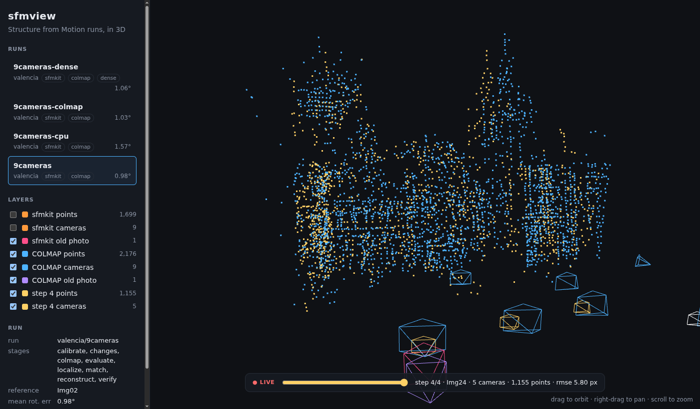
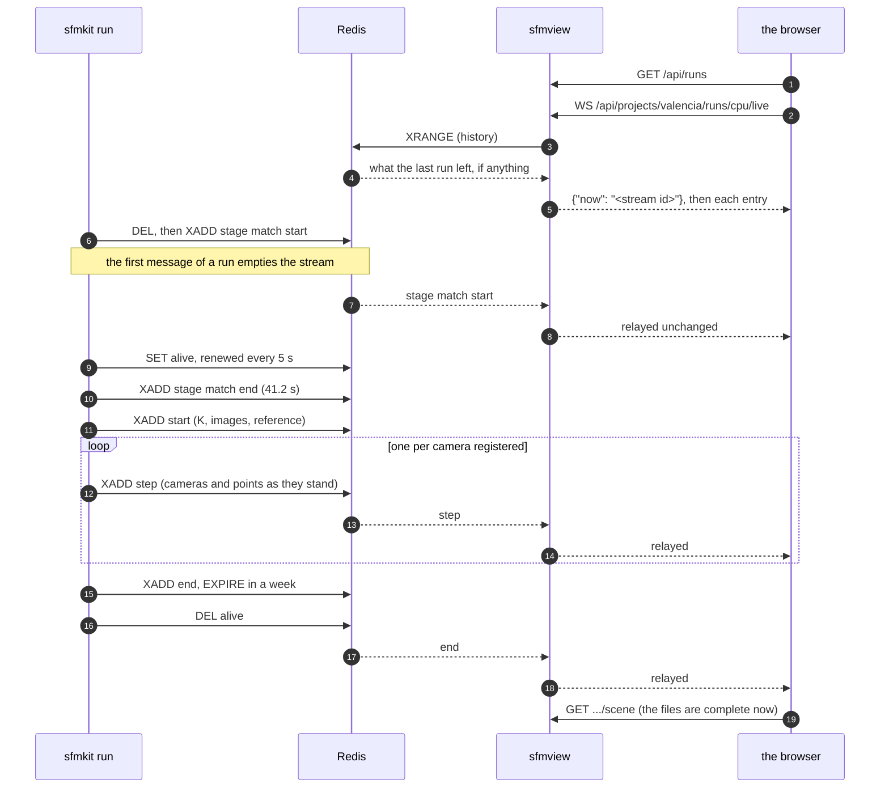

# sfmview, the viewer

A web page that draws a run in 3D: sfmkit's reconstruction, COLMAP's, the old
photo as each of them placed it, and COLMAP's dense cloud; and, while
`reconstruct` works, the model growing step by step, with a timeline to rewind
it. It is its own package, `packages/viewer/`, with its own dependencies and
image, and it does not import sfmkit: the two share files and a message
format, described below, and nothing else.


## Running it

```bash
conda create -n sfmview python=3.11
conda activate sfmview
cd packages/viewer
pip install --no-deps -r requirements.txt -r requirements-dev.txt
pip install --no-deps -e .
cd ../..
sfmview --projects projects        # http://127.0.0.1:8000
```

`--projects`, `--host`, `--port` and `--broker`, or `SFMVIEW_PROJECTS`,
`SFMVIEW_HOST`, `SFMVIEW_PORT` and `SFMVIEW_BROKER` in a container. The page loads three.js from jsDelivr, so the browser needs the
internet.

With Docker, from the root:

```bash
docker compose up --build viewer    # http://127.0.0.1:8000
```

The service mounts `runs/` and `data/` read-only and publishes port 8000 on the
host's loopback only. From another machine, open an SSH tunnel to the host,
`ssh -N -L 8000:127.0.0.1:8000 <host>`, and browse http://localhost:8000 there.
The image sets `SFMVIEW_HOST=0.0.0.0`: a published port arrives on the
container's network address, not on its loopback. It also carries its own
healthcheck, `sfmview-health`, which asks `/api/health` from inside the
container (the image has Python, not curl); in a container, set the port with
`SFMVIEW_PORT` rather than `--port`, so the check finds it.

### Live progress

sfmkit publishes its steps when `SFMKIT_BROKER` names a Redis server, and the
viewer reads them when `--broker` names the same one. Compose sets both to its
`redis` service, so from the root:

```bash
docker compose up -d viewer         # Redis first, then the viewer once Redis is healthy
docker compose run --rm cli reconstruct --config projects/valencia/configs/cpu.yaml
docker compose down                 # when done: stops both
```

`cli-gpu` works the same. Redis publishes no port: the containers find it by
name, `redis`, on compose's network, and nothing outside reaches it. Only the
viewer depends on it, so `docker compose run cli` alone starts no Redis and
publishes nothing. Its data lives in a named volume, `redis-data`, so `down`
no longer takes the streams with it. Without Docker, run a Redis yourself and
point both at it:
`sfmview --broker redis://localhost:6379` and
`SFMKIT_BROKER=redis://localhost:6379 sfmkit reconstruct ...`.

Neither knows the other: sfmkit writes to the broker and the viewer reads from
it. The stream keeps a run's messages, so a page opened late, or reloaded,
shows every step; a finished run's stream stays until the run is repeated or a
week has passed, so its timeline can still be rewound. Without a broker sfmkit
runs as before, and
if the broker goes away mid-run it says so once and carries on. A run at work
is marked live in the list, and a run whose heartbeat stops before its `end`
(sfmkit killed, or the broker lost mid-run) is no longer shown as live.



## What it reads: the contract with sfmkit

A run is `projects/<name>/runs/<config>/`, one directory per stage. The viewer only
reads, and only these:

| File | Stage | What the viewer takes |
|---|---|---|
| `*/manifest.json` | every stage | `stage`, `timestamp`, `config` (`sfm.reference`, `localize.query`), `device` where a stage records one (`match`, `colmap`); from `evaluate`'s, `mean_rotation_error_deg`, `max_rotation_error_deg`, `n_cameras`, `query_rotation_error_deg` |
| `reconstruct/reconstruction.npz` | reconstruct | `K` (3×3), `image_names` (N), `rotations` (N×3×3), `translations` (N×3), `points` (M×3); `colors` (M×3, uint8) if present |
| `localize/query_pose.npz` | localize | `R`, `t`; `K` if present |
| `colmap/{cameras,images,points3D}.txt` | colmap | COLMAP's text model, image names without extension |
| `evaluate/evaluation.json` | evaluate | `reference`, `scale_image` |
| `dense/fused.ply` | dense | served as it is; the browser parses it |

Poses are world to camera, `x_cam = R X + t`, in OpenCV's axes: x right, y down,
z forward. A run missing some of these shows what it has.

Live steps are the other half: a Redis stream per run,
`sfmkit:steps:<project>/<config>`, one JSON message per entry in its `data`
field. [`sfmcontracts/step.schema.json`](../packages/contracts/src/sfmcontracts/step.schema.json) defines
them: a `start` (the run's K, its images and the reference camera; the stream
is emptied first), a `step`
after each camera registered and each global refinement (the cameras and the
triangulated points as they stood, flat, thinned past 20 000 points), and an
`end`, or `failed` with the
reason when the run stops short, Ctrl-C included. The stream is named after the
run's directory, as the viewer names runs, so `--out` does not write into
another run's stream. Beside it, while `reconstruct` works, sfmkit keeps
`sfmkit:alive:<project>/<config>` set with a 15 s expiry and renews it every
5 s: a heartbeat. The key goes when the run ends, however it ends, and a run
killed outright stops renewing it, so the viewer can tell a run at work from a
stream that stopped without an `end`. Both packages test
against the schema and its examples, with the checker in `sfmcontracts.check`,
so a change on one side breaks a test on the other, not a run.

### How it goes



The message format is `sfmcontracts/step.schema.json`; who publishes what and who
listens is `sfmcontracts/asyncapi.yaml`, an AsyncAPI 3 document that points at
that schema rather than repeating it. The HTTP side's equivalent is the
OpenAPI FastAPI serves at `/docs`.

## One frame for two reconstructions

Each reconstruction has its own origin, orientation and scale. The viewer
brings them together as sfmkit's `evaluate` does, so what it draws is what is
scored: both are expressed in the reference camera's frame, and COLMAP's is
scaled so that `scale_image` sits as far from the reference as it does in
sfmkit's. The shared frame is sfmkit's reference camera, at sfmkit's scale; the
dense cloud, being COLMAP's, takes COLMAP's transform. The server sends each
model in its own coordinates with the 4×4 that moves it
(`sfmview/domain/frames.py`); the page converts OpenCV's axes to three.js's in
one place (`web/js/scene.js`).

## The API

| Route | |
|---|---|
| `GET /api/health` | `{"status": "ok", "live": ...}`, and whether the broker answers |
| `GET /api/runs` | every run: stages, layers (`sfmkit`, `colmap`, `dense`), metrics, `devices` (stage to `cuda` or `cpu`), and `running`, whether its heartbeat beats (`null` without a broker) |
| `GET /api/runs/{project}/{config}/scene` | the models, with cameras, flat point arrays and their transforms |
| `GET /api/runs/{project}/{config}/dense.ply` | the dense cloud |
| `WS /api/runs/{project}/{config}/live?after=<id>` | `{"now"}`, the server's clock, then the run's stream as `{"id", "message"}`: history first, then as it comes |
| `GET /docs`, `GET /redoc` | the API's OpenAPI, from FastAPI, two ways |

Names are checked as single path components, and a run directory must lie
inside the runs root, symlinks included. A refused WebSocket is accepted and
then closed with a code (4404 not a run, 4503 live progress off), as a refusal
before the handshake reaches a browser as a bare HTTP 403.

A stream id starts with the milliseconds Redis wrote it at; with the server's
clock from the first frame, the page tells what happened after it connected
(an `end` that means new files) from history (an `end` it only replays),
without trusting the browser's clock. localize's and evaluate's outputs older
than the reconstruction are ignored: they describe the one before.

## Inside

Ports and adapters, checked by import-linter (`packages/viewer/pyproject.toml`):

```
src/sfmview/
├── domain/      values (RunId, Camera, Model, Scene) and frames.py; no I/O
├── ports.py     RunStore and StepSource, the interfaces the API needs
├── adapters/    runs_fs.py (RunStore over runs/), colmap_text.py, sfmkit_files.py,
│                redis_steps.py and memory_steps.py (StepSource)
├── api/         create_app(store, steps), the routes, the WebSocket, the JSON schemas
├── web/         index.html, style.css, js/{main,api,live,ui,scene,geometry}.js
└── main.py      the composition root: settings, adapters, uvicorn
```

The API sees the ports and never an adapter, so its tests run on a store and
a stream in memory; a new source of runs, or another broker, is a new adapter
and nothing else. The two `StepSource`s pass one test suite, Redis's when a
server is given (`SFMVIEW_TEST_REDIS`, as CI does).
