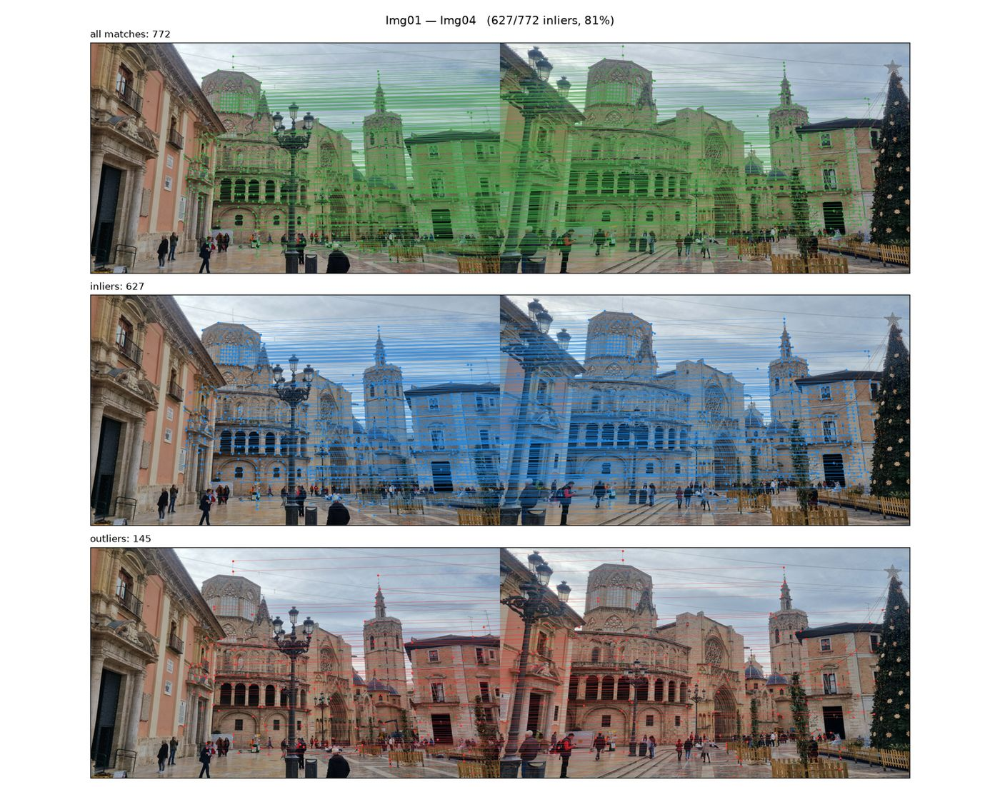
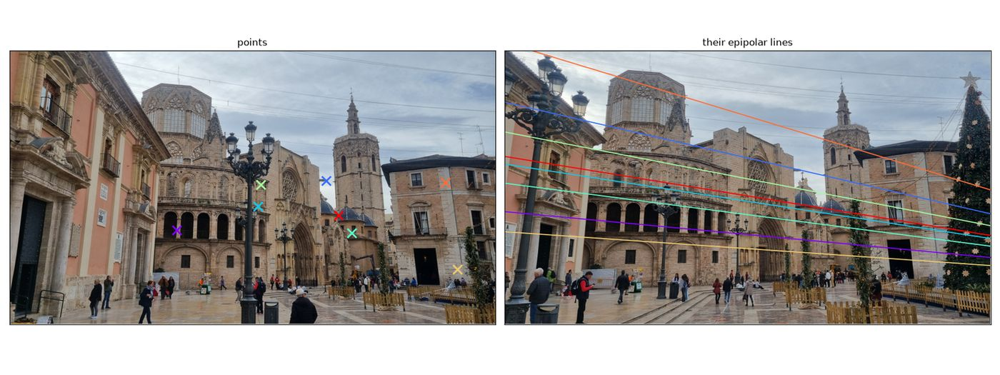
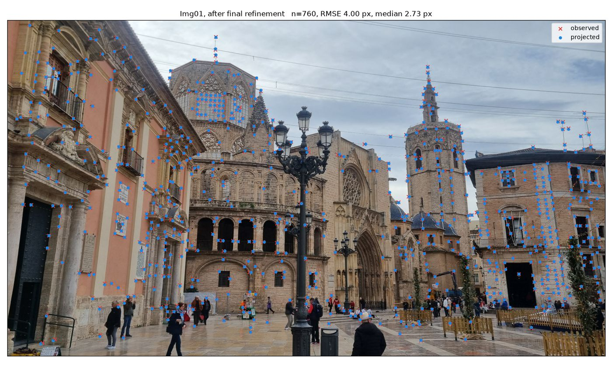

# What a run holds

A run is a directory per stage under `projects/<name>/runs/<config>/`. Everything in
it is reproducible from the config and the photographs, which is why `runs/` is
not in version control, except the frozen runs `runs/reference-*` — one of each kind — which are.

```
projects/valencia/runs/gpu-dense/
├── calibrate/   K.txt, manifest.json
├── match/       Img01__Img02.npz …            one per pair
├── verify/      Img01__Img02.npz …            the same pairs, inliers only
├── reconstruct/ reconstruction.npz, reconstruction_before_refinement.npz, …
├── localize/    query_pose.npz
├── colmap/      cameras.txt, images.txt, points3D.txt, database.db
├── dense/       fused.ply
├── evaluate/    evaluation.json
├── changes/     overlay_Img_Old_on_Img01.png, changes_…png, score.png
└── figures/     comparison.png, cameras.png, matches_…png, …
```

## Every stage writes a manifest

`<stage>/manifest.json` is the record of how that stage ran:

```json
{
  "stage": "evaluate",
  "config_path": "projects/valencia/configs/gpu-dense.yaml",
  "timestamp": "2026-09-12T16:50:18.283605+00:00",
  "git_commit": "82e4ac97f2a1c7ebd6d876e292d406147f0440e8",
  "versions": {"sfmkit": "0.1.0", "numpy": "1.26.4", "scipy": "1.17.1", "python": "3.11.16"},
  "config": { "...": "the whole config, as loaded" },
  "mean_rotation_error_deg": 0.2998,
  "max_rotation_error_deg": 1.3360,
  "scale": 0.4589,
  "n_cameras": 14,
  "query_rotation_error_deg": 0.6037,
  "query_position_error": 0.0405
}
```

The commit is the code that produced the result — including inside an image,
where it is baked in at build time — and the stage's own numbers sit beside it.
That is what makes a figure in a paper traceable to a state of the repository.

## The arrays

| File | Keys |
|---|---|
| `match/ImgA__ImgB.npz`, `verify/…` | keypoints of both images, the matches, and the verified subset |
| `reconstruct/reconstruction.npz` | `K` (3×3), `image_names` (N), `rotations` (N×3×3), `translations` (N×3), `points` (M×3), `colors` (M×3 uint8) when known |
| `localize/query_pose.npz` | `R`, `t`, and `K` when it was estimated |
| `dense/fused.ply` | COLMAP's fused cloud, binary PLY |

Poses are world to camera, `x_cam = R X + t`, in OpenCV's axes: x right, y
down, z forward. Points that failed to triangulate are `NaN` rather than
missing, so a point keeps its track's index for its whole life.

## `evaluate/evaluation.json`

The scored comparison: the scale between the two models, the per-camera
rotation and position errors after alignment, and the query apart from the
rest, since it is placed by a different stage against a different reference.

## The figures

`sfmkit figures` draws a finished run: the two models side by side
(`cameras.png`, `comparison.png`), and the diagnostics of the stages that got
there.



*`Img01`-`Img04`: what the matcher produced, and what geometric verification
kept. The rejected matches are not scattered at random -- they gather in the
sky and on the repeated arcades, which is the signature of repeated structure
rather than of a matcher failing.*



*The epipolar geometry the verified pairs imply: a point in one photograph and
the line it must lie on in the other.*



*Where the reconstruction projects, against where the keypoints actually are.*

There is also a before-and-after pair around the final global refinement, drawn
from two reconstructions that genuinely existed --
`reconstruction_before_refinement.npz` and `reconstruction.npz`. Expect little
between them: by that point a bundle adjustment has already run after every
camera, and most of the correction has been made.

## Reading a run without sfmkit

The viewer does exactly that, through a fixed set of files —
[the contract](../viewer/index.md#what-the-viewer-reads) — and the same files
are what the figures and the reporting tools read. Nothing in a run needs
sfmkit installed to be understood: arrays in `.npz`, text from COLMAP, JSON for
the rest.
