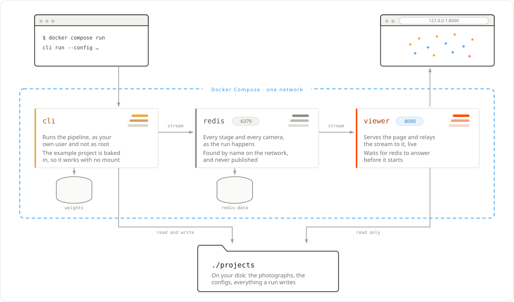

# Install with Docker

Three images, one for each thing that runs: the CLI on the CPU, the CLI on a
GPU, and the viewer. `compose.yaml` at the repository root wires them together
with a Redis for live progress.

Nothing is installed on the host beyond Docker itself — no conda, no COLMAP, no
CUDA toolkit (the GPU image still needs the host's NVIDIA driver and the
container toolkit).



*What each service is, what crosses the boundary and what does not. `./projects`
is one directory on your disk mounted into two containers, writable for the
pipeline and read-only for the viewer; the named volumes belong to Docker. Only
the viewer publishes a port, and only on the loopback address.*

!!! info "Published images"
    Nothing is published yet: the images go out when a release is published,
    and there has been no release. They will land in two registries at once —
    GitHub's, which needs no account of ours, and Docker Hub, which is where
    people look:

    ```bash
    # Coming, once there is a release
    # docker compose pull                         # both, by the names compose already uses
    # docker pull ghcr.io/dpadillaor/sfmkit:cpu   # docker pull padidavid/sfmkit:cpu
    # docker pull ghcr.io/dpadillaor/sfmview      # docker pull padidavid/sfmview
    ```

    GitHub's registry is the one compose names; Docker Hub carries the same
    images under `padidavid/`, for anyone whose network is happier with it.

    Until then, the commands below build the same images locally, under those
    same names.

## First, your user

The CLI container writes runs into a mounted directory, so it runs as you
rather than as root. Compose reads that from `.env`:

```bash
make env        # writes UID= and GID= into .env
```

## Build

```bash
make image                    # ghcr.io/dpadillaor/sfmkit:cpu
make image DEVICE=gpu         # ghcr.io/dpadillaor/sfmkit:gpu
docker compose build viewer   # ghcr.io/dpadillaor/sfmview
```

The images are named as they are published, so once there is a release the same
compose file pulls them instead:

```bash
docker compose pull
```

`make image` passes the current commit in as a build argument, and every run
made inside the image records it in its manifest: a result can be traced to the
code that produced it.

Both images run as an ordinary user, uid 1000, rather than as root — compose
overrides that with your own uid so the runs it writes belong to you.

## Run the pipeline

```bash
docker compose run --rm cli run --config projects/valencia/configs/cpu.yaml
docker compose run --rm cli-gpu run --config projects/valencia/configs/gpu-dense.yaml
```

`cli` is the entry point `sfmkit`, so everything after the service name is the
command line you would type locally. It mounts `./projects` — one directory,
because a project holds its photographs, its configs and its runs — writable, so
the output lands in the repository as usual. That a run writes nothing but its
own directory is checked in CI rather than promised by the mount.

Each image ships the frozen run it can reproduce: `sfmkit:cpu` carries
`projects/valencia/runs/reference-cpu`, `sfmkit:gpu` carries
`projects/valencia/runs/reference-gpu-dense` with its
dense cloud. You can open the viewer on them before running anything yourself.

To re-run one rather than look at it, copy it to the name its config writes —
`cpu.yaml` writes `cpu`, and the frozen one is called `reference-cpu` precisely
so that a run cannot land on top of it:

```bash
cp -r projects/valencia/runs/reference-cpu projects/valencia/runs/cpu
docker compose run --rm cli verify --config projects/valencia/configs/cpu.yaml
```

## A shell inside

```bash
make shell            # or: make shell DEVICE=gpu
```

The image's own environment with the same mounts a run gets: for reading a
traceback from inside, or for seeing what the container can actually reach. Its
prompt greets `I have no name!`, because the uid it runs as has no entry in the
image's `/etc/passwd`; nothing else is affected, since permissions go by number.

## The feature weights

They are not baked into the image — SuperPoint's licence is for non-commercial
research and not ours to pass on — so the first `match` downloads them into
whatever is mounted at `/opt/torch`. Compose mounts a named volume by default,
so the download happens once:

```bash
docker compose run --rm cli match --config projects/valencia/configs/cpu.yaml
```

To keep them somewhere of your own, point `SFMKIT_WEIGHTS` at a directory:

```bash
SFMKIT_WEIGHTS=$HOME/.cache/torch docker compose run --rm cli match --config ...
```

If they are missing and there is no network, the run stops with the two URLs
and the paths to put them in, not a stack trace.

## The viewer

```bash
docker compose up -d viewer         # http://127.0.0.1:8000
docker compose down                 # stops the viewer and its Redis
```

It mounts `./projects` read-only — it never writes — and publishes port 8000
**on the host's loopback only**. From another machine, tunnel to it:

```bash
ssh -N -L 8000:127.0.0.1:8000 <host>
```

The image listens on `0.0.0.0` inside the container, because a published port
arrives on the container's network address rather than on its loopback, and it
carries its own healthcheck (`sfmview-health`, which asks `/api/health` from
inside; the image has Python, not curl). In a container set the port with
`SFMVIEW_PORT` rather than `--port`, so the healthcheck finds it too.

## Watching a run as it is built

Live progress is a Redis stream that sfmkit writes and the viewer reads;
compose points both at its own `redis` service:

```bash
docker compose up -d viewer                                   # Redis, then the viewer
docker compose run --rm cli reconstruct --config projects/valencia/configs/cpu.yaml
```

Redis publishes no port: the containers find it by name on compose's network
and nothing outside reaches it. Only the viewer depends on it, so
`docker compose run cli` on its own starts no Redis and publishes nothing —
the run goes ahead either way. `down` removes Redis's container and the next
`up` starts an empty one, losing the streams; `stop` keeps them.

## The services

| Service | Image | What it is |
|---|---|---|
| `cli` | `ghcr.io/dpadillaor/sfmkit:cpu` | the pipeline, CPU only; entry point `sfmkit` |
| `cli-gpu` | `ghcr.io/dpadillaor/sfmkit:gpu` | the same with CUDA PyTorch and COLMAP; `gpus: all` |
| `viewer` | `ghcr.io/dpadillaor/sfmview` | the web viewer on port 8000 |
| `redis` | `redis:7-alpine` | live progress, internal to the compose network |

## Publishing an image

The CPU and viewer images are built and pushed by CI when a release is
published, to GHCR and to Docker Hub. GHCR needs nothing: GitHub lends the
workflow a credential for the duration. Docker Hub needs two repository
secrets, `DOCKERHUB_USERNAME` and `DOCKERHUB_TOKEN`; without them that half is
skipped rather than failed, so a fork with no Docker Hub account still gets a
green build and its images on GHCR.

Each image goes out with three tags: the version from the release, a moving one
(`cpu` for the pipeline, `latest` for the viewer) and the short commit, for
when a build has to be named exactly.

The GPU image is not built there: CUDA PyTorch and COLMAP's CUDA build do not fit a hosted runner's
disk, so it is built where there is a GPU and published by hand:

```bash
docker login ghcr.io -u <you>     # once, with a token that can write packages
make push DEVICE=gpu
```

`make push` refuses to publish from a working tree with uncommitted changes,
and stamps the commit into the image twice: as `SFMKIT_GIT_COMMIT`, which every
run manifest records, and as an OCI label. So a published image can always be
traced back, whoever built it:

```bash
docker inspect --format '{{index .Config.Labels "org.opencontainers.image.revision"}}' \
  ghcr.io/<owner>/sfmkit:gpu
```

## GPU

The `cli-gpu` service asks for `gpus: all`, which needs NVIDIA's container
toolkit on the host:

```bash
# Debian/Ubuntu, from NVIDIA's repository
sudo apt-get install -y nvidia-container-toolkit
sudo nvidia-ctk runtime configure --runtime=docker
sudo systemctl restart docker
docker compose run --rm cli-gpu --help      # should print sfmkit's help
```

Without it the service fails to start; the CPU image does everything except
`dense`, which is GPU-only in COLMAP.
