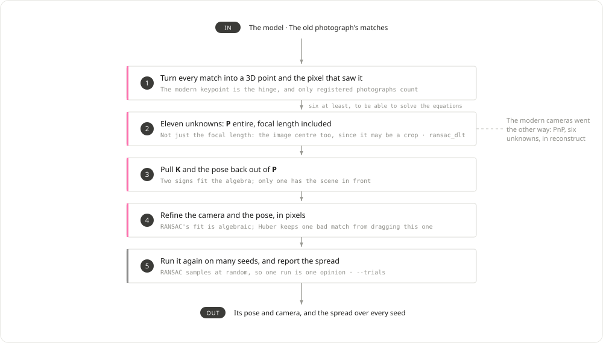

# The old photograph

Where an undated photograph of the Plaza de la Virgen was taken from, and why
the answer took some arguing. It is the deliverable of the project and the one
image the pipeline treats differently at every stage.

## Why it is handled apart

It was taken by another camera, of unknown focal length, perhaps cropped, a
century before the rest. So:

| Stage | The fourteen modern photos | `Img_Old`, the old one |
|---|---|---|
| `match` | every pair | the reference only: it shares few features with any of them |
| `reconstruct` | registered | left out, so a shaky camera cannot bend the map |
| `localize` | — | placed against the finished map, its K estimated with its pose |
| `evaluate` | scored together | scored apart, against COLMAP's placement of it |

*There is no branch here: the old camera is unknown, so the whole projection
matrix is solved every time. PnP would assume the phone's calibration, which
this photograph does not have.*

## The 11.5° argument

For a long time sfmkit's placement and COLMAP's disagreed by 11.5°, and it was
not obvious which was wrong. They agreed within 0.8° on every modern camera.

The disagreement was not a misplacement but a trade. **On a nearly planar
facade, tilting a camera up and shifting its principal point down project
almost alike.** sfmkit's DLT let the principal point go where the pixels wanted
it (241, 323 in a 557x418 image); COLMAP pinned it at the centre (278.5, 209)
and had to tilt the camera up instead.

Two measurements settled it:

- **The phones were held level.** Taking the vertical as the direction
  orthogonal to the nine phones' x axes — they are orthogonal to it within
  0.6° — the phones look up 10 to 14°, as anyone photographing a facade does.
  sfmkit puts the old camera level (pitch 0.2°, roll 1.5°); COLMAP had it
  looking up 11.2°, and the 11.5° between the two is almost all pitch.
- **A level camera with a low principal point is how architecture was
  photographed.** A view camera's rising front shifts the lens up to take in a
  tall facade while keeping the verticals parallel; a cropped print does the
  same. It is still a pinhole, only off-centre.

So the "error against COLMAP" was COLMAP's, for this photograph. COLMAP's query
pass now refines the principal point (`ba_refine_principal_point`, the scene's
cameras put back afterwards): it finds (241, 334) against localize's (241, 323),
the camera level, and the disagreement falls from 11.5° to about 1°. A model
made elsewhere with the point pinned — the course's — is refined the same way
by the `colmap` stage (`refine_query`), which takes its old photo from 11.9°
to 4.4°.

## The camera it estimates

Nothing about that camera is known: not its focal length, not where its
principal point sits after whatever cropping the plate has had. All eleven
unknowns of the projection come out of the fit, which makes COLMAP's own
estimate for the same photograph the only check there is. On the `cpu` example,
where both place a 557x418 plate:

| | fx | fy | principal point |
|---|---|---|---|
| localize, refined | 552.0 | 555.8 | (238.0, 330.0) |
| COLMAP's query pass | 553.8 | 553.8 | (243.5, 332.0) |

Within 0.4% in focal length and six pixels in the centre, from two programs
that share the photographs and nothing else. The fit is free to return
whatever aspect ratio it likes -- COLMAP's `SIMPLE_RADIAL` is not -- and it
returns 0.7% away from square, which is the more telling of the two figures:
the course's pipeline, which assumed a K instead of estimating one, carried
fx = 27139 against fy = 7054 for this plate, a 3.8:1
camera with no physical meaning, and that is what its presentation was seeing
when it called the old camera "rotated a little bit weird".

## What refining the camera bought

RANSAC leaves a linear fit that minimises an algebraic error. Minimising the
pixels instead, under a Huber loss, over the inliers it found:

| | Before | After |
|---|---|---|
| Reprojection, median over 20 seeds | 14.1 px | **2.0 px** |
| Spread of the camera's centre over those seeds | 0.235 | **0.031** |
| Against COLMAP, `cpu` | 1.60° | **1.32°** |
| Against COLMAP, `gpu-dense` | 0.91° | **0.60°** |

The instability is what mattered: eleven unknowns from a handful of
correspondences used to land somewhere slightly different on every seed.

`localize.refine` chooses what moves: `none`, the `pose` alone, or the whole
`camera`, K included when K was estimated here.

## How far to trust the number

Not to the second decimal. The reference itself moves: COLMAP registers this
one photograph in a second pass, from at best 32 matches, with nine unknowns,
and its own randomness. The same configuration has scored it 1.20°, 0.97° and
3.84° across runs, while the fourteen modern cameras agreed within 0.03°.

A difference of a degree on the old photograph is therefore within the noise of
what it is measured against; a difference of ten degrees, as before, was not.
To do better one would run COLMAP's query pass many times and report its
spread, or compare both placements by their reprojection error on one neutral
set of correspondences.
