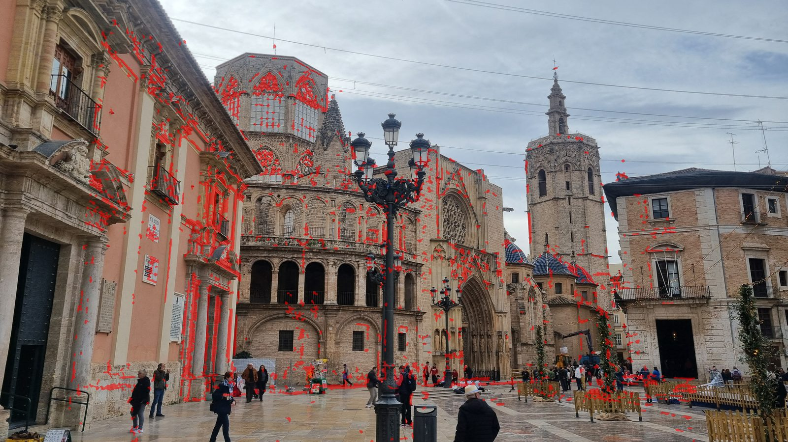

# Results

Fifteen photographs of the Plaza de la Virgen in Valencia: fourteen from a
phone, and one undated one, a century older. The question is where the old one
was taken from, and what has changed since.

<video controls muted loop playsinline width="100%">
  <source src="../../figures/old_photo.mp4" type="video/mp4">
</video>

## The reconstruction, against COLMAP

Both configs register all fourteen modern photographs. The error is the angle
between each camera's rotation and COLMAP's, after aligning the two models; the
old photograph is scored apart, because it is placed by a different stage.

| | `cpu` | `gpu-dense` |
|---|---|---|
| Cameras | 14 | 14 |
| Points | 2 850 | 2 830 |
| Mean rotation error | **0.338°** | **0.300°** |
| Worst camera | 1.328° | 1.336° |
| The old photograph | 1.32° | 0.60° |

The two differ because matching on a GPU and on a CPU does not give quite the
same matches, and because COLMAP, which is the thing being measured against,
reconstructs from scratch each time with its own randomness.

<video controls muted loop playsinline width="100%">
  <source src="../../figures/against_colmap.mp4" type="video/mp4">
</video>

*Every frame is a step of a real run: our cameras, COLMAP's, and the gap
between them closing.*

## How far to trust that number

Not to the second decimal, and the honest reason is worth stating. COLMAP
registers that one photograph in a second pass, from at best 32 matches, with
nine unknowns and its own randomness: the same configuration has scored it
1.20°, 0.97° and 3.84° across runs, while the fourteen modern cameras agreed
within 0.03°.

A difference of a degree on the old photograph is therefore inside the noise of
what it is measured against. A difference of ten degrees was not, and there
was one.

## The 11.5° argument

For a long time our placement and COLMAP's disagreed by 11.5°, while agreeing
within 0.8° on every modern camera. The disagreement turned out not to be a
misplacement but a trade: **on a nearly planar facade, tilting a camera up and
shifting its principal point down project almost alike.** Our DLT let the
principal point go where the pixels wanted it; COLMAP pinned it at the centre
of the image and had to tilt the camera up instead.

Two measurements settled which was right:

- **The phones were held level.** Taking the vertical as the direction
  orthogonal to the fourteen phones' x axes, they look up 10 to 14°, as anyone
  photographing a facade does. Ours puts the old camera level; COLMAP had it
  looking up 11.2°, and the 11.5° between them was almost all pitch.
- **A level camera with a low principal point is how architecture was
  photographed.** A view camera's rising front shifts the lens up to take in a
  tall facade while keeping the verticals parallel, and a cropped print does
  the same. It is still a pinhole, only off-centre.

Freeing COLMAP's principal point for that one photograph brings the
disagreement down to about a degree. The error was in the reference, not in the
answer.

Which is why the `colmap` stage frees it, and why no number on this page is
scored against a pinned one. A model COLMAP computes here is placed with
`ba_refine_principal_point` on and every other frame held fixed; a model handed
to us with the query already pinned, as the course's was, has that one camera
refined before anything is measured, its pose and its intrinsics moving while
every other camera, every other pose and every point stay put. The stage prints
where the principal point went.

## Refining the camera after RANSAC

RANSAC leaves a linear fit that minimises an algebraic error. Minimising the
reprojection error itself, in pixels, under a Huber loss, over its inliers:

| | Before | After |
|---|---|---|
| Reprojection, median over 20 seeds | 14.1 px | **2.0 px** |
| Spread of the camera's centre over those seeds | 0.235 | **0.031** |

The instability is what mattered: eleven unknowns from a handful of
correspondences used to land somewhere slightly different on every seed.

## The bundle adjustment

The original solver was `scipy.optimize.least_squares`. Writing one for this
problem (Levenberg–Marquardt, an analytic Jacobian checked against central
differences to 1e-8, the points eliminated with the Schur complement, the
6N−7 camera system solved directly, stopping at Ceres's function tolerance):

| | scipy | ours |
|---|---|---|
| Bundle adjustments, summed | 203 s (5.5 to 41.5 s each) | **3.5 s** (0.1 to 0.9 s) |
| Whole run from `verify` | 4 min 20 s | **25 s** |
| Mean rotation error | 0.981° | **0.875°** |

And the reason the accuracy moved as well as the speed: **scipy's solve never
converged.** On every bundle it used up its evaluation budget and stopped; ours
converges in 27 to 55 Jacobians, and reaches a lower robust cost (67 983
against 72 097 on the final bundle). The published 0.981° had been a bundle
stopped short, and so were the thresholds that had been tuned against it.

scipy's solver is still there, as `sfm.bundle_solver: scipy`, because a claim
like that ought to be re-runnable.

## The thresholds were searched, not guessed

Three numbers decide how much the reconstruction admits: `pnp_threshold`, how
far a projection may fall from its keypoint and still count when a camera is
registered; `min_triangulation_angle_deg`, how much parallax a pair of rays
needs before their intersection is trusted; and `max_reprojection_error`, how
far a point may sit from where it projects before it is thrown away.

They were chosen by running the reconstruction over a grid of combinations and
scoring each against COLMAP, because the first search
returned two results that no amount of local reasoning would have produced.

**A tighter reprojection threshold is worse, not safer.** Discarding a point
because it does not yet fit also discards the correspondence a later bundle
adjustment would have used to pull it into line, and the next camera is left
with less to register against. Averaged across the grid, 3.0 px registered six
cameras; 12.0 px registered 7.7.

**The triangulation angle is not monotonic.** Raising it from 0.5° to 2.0°
*increased* the cameras registered, from 6.0 to 7.9: points triangulated from
near-parallel rays have badly conditioned depth, and admitting them corrupts
the pose of every camera that later leans on them. Raising it further to 4.0°
dropped back to 7.1: now genuinely useful points were being refused. There is
an optimum, and it is at neither end.

Both are the same lesson. In an incremental pipeline the cost of a decision is
paid downstream of where it is made, which is what puts these thresholds out of
reach of argument and makes an hour of compute the cheaper answer.

**Searched again when everything around them had changed** (2026-09-12): the
EXIF K, the Schur solver, five more photographs, fourteen cameras instead of
nine. Sixty-four combinations this time, since a reconstruction now takes
seconds. The chosen values came out as good as anything on the grid.

| `pnp` | angle | reproj | cameras | points | mean rotation |
|---|---|---|---|---|---|
| 6.0 | 4.0 | 12.0 | 14 | 2668 | **0.326°** |
| 9.0 | 4.0 | 12.0 | 14 | 2668 | 0.327° |
| **6.0** | **2.0** | **12.0** | 14 | **2849** | 0.341° |

The one combination that beats the current settings does so by 0.015° and 181
fewer points. At that distance the ranking is noise and the points are worth
keeping, so nothing changed.

What the second search added: above 6.0 the PnP threshold stops mattering:
6.0, 9.0 and 12.0 all register every camera and score within 0.002° of each
other, while 3.0 never manages more than thirteen. And the triangulation angle
no longer decides anything, because with fourteen photographs every value from
0.5° to 4.0° registers them all. The optimum the first search found was a
feature of a nine-camera graph, where a single badly conditioned point could
still poison a pose.

## What changed in the square

The old photograph warped onto today's, and the difference in tone once the two
are matched: the lamp posts have moved, the arcade now opens onto a courtyard,
a building beside the cathedral is gone, and the people are in both but never
in the same place.

7.6% of the overlap is flagged as changed. Most of that is the square's floor
and its passers-by; the cathedral itself, minus one building, is where it was.

**How far the figure can be read.** A homography aligns one plane exactly and
nothing else. The cathedral's facade is near enough to flat, so what it flags
there is change; the buildings down the sides of the square are at very
different depths and register poorly, so much of what is marked there is
misalignment instead. That is the method, not a fault in it, and the honest
reading of the picture is that the facade is comparable and the flanks are
not. Comparing them properly would mean warping through the model rather than
through a plane, every pixel of the old photograph carried onto today's by
the depth the reconstruction gives it.
