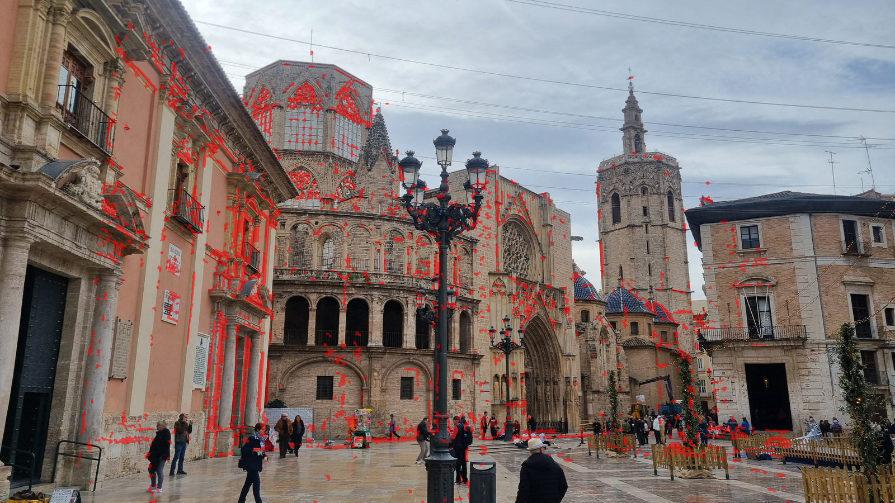

# Results

Fifteen photographs of the Plaza de la Virgen in Valencia: fourteen from a
phone, and one undated one, a century older. The question is where the old one
was taken from, and what has changed since.

<video controls muted loop playsinline width="100%">
  <source src="../../figures/old_photo.mp4" type="video/mp4">
</video>

## The reconstruction, against COLMAP

Both configs register all fourteen modern photographs. The error is the angle
between each camera's rotation and COLMAP's, after aligning the two models; the
old photograph is scored apart, because it is placed by a different stage.

| | `cpu` | `gpu-dense` |
|---|---|---|
| Cameras | 14 | 14 |
| Points | 2 850 | 2 830 |
| Mean rotation error | **0.338°** | **0.300°** |
| Worst camera | 1.328° | 1.336° |
| The old photograph | 1.32° | 0.60° |

The two differ because matching on a GPU and on a CPU does not give quite the
same matches, and because COLMAP — which is the thing being measured against —
reconstructs from scratch each time with its own randomness.

<video controls muted loop playsinline width="100%">
  <source src="../../figures/against_colmap.mp4" type="video/mp4">
</video>

*Every frame is a step of a real run: our cameras, COLMAP's, and the gap
between them closing.*

## How far to trust the old photograph's number

Not to the second decimal, and the honest reason is worth stating. COLMAP
registers that one photograph in a second pass, from at best 32 matches, with
nine unknowns and its own randomness: the same configuration has scored it
1.20°, 0.97° and 3.84° across runs, while the fourteen modern cameras agreed
within 0.03°.

A difference of a degree on the old photograph is therefore inside the noise of
what it is measured against. A difference of ten degrees was not — and there
was one.

## The 11.5° argument

For a long time our placement and COLMAP's disagreed by 11.5°, while agreeing
within 0.8° on every modern camera. The disagreement turned out not to be a
misplacement but a trade: **on a nearly planar facade, tilting a camera up and
shifting its principal point down project almost alike.** Our DLT let the
principal point go where the pixels wanted it; COLMAP pinned it at the centre
of the image and had to tilt the camera up instead.

Two measurements settled which was right:

- **The phones were held level.** Taking the vertical as the direction
  orthogonal to the fourteen phones' x axes, they look up 10 to 14°, as anyone
  photographing a facade does. Ours puts the old camera level; COLMAP had it
  looking up 11.2°, and the 11.5° between them was almost all pitch.
- **A level camera with a low principal point is how architecture was
  photographed.** A view camera's rising front shifts the lens up to take in a
  tall facade while keeping the verticals parallel, and a cropped print does
  the same. It is still a pinhole, only off-centre.

Freeing COLMAP's principal point for that one photograph brings the
disagreement down to about a degree. The error was in the reference, not in the
answer.

## Refining the camera after RANSAC

RANSAC leaves a linear fit that minimises an algebraic error. Minimising the
reprojection error itself, in pixels, under a Huber loss, over its inliers:

| | Before | After |
|---|---|---|
| Reprojection, median over 20 seeds | 14.1 px | **2.0 px** |
| Spread of the camera's centre over those seeds | 0.235 | **0.031** |

The instability is what mattered: eleven unknowns from a handful of
correspondences used to land somewhere slightly different on every seed.

## The bundle adjustment

The original solver was `scipy.optimize.least_squares`. Writing one for this
problem — Levenberg–Marquardt, an analytic Jacobian checked against central
differences to 1e-8, the points eliminated with the Schur complement, the
6N−7 camera system solved directly, stopping at Ceres's function tolerance:

| | scipy | ours |
|---|---|---|
| Bundle adjustments, summed | 203 s (5.5 to 41.5 s each) | **3.5 s** (0.1 to 0.9 s) |
| Whole run from `verify` | 4 min 20 s | **25 s** |
| Mean rotation error | 0.981° | **0.875°** |

And the reason the accuracy moved as well as the speed: **scipy's solve never
converged.** On every bundle it used up its evaluation budget and stopped; ours
converges in 27 to 55 Jacobians, and reaches a lower robust cost (67 983
against 72 097 on the final bundle). The published 0.981° had been a bundle
stopped short — and so were the thresholds that had been tuned against it.

scipy's solver is still there, as `sfm.bundle_solver: scipy`, because a claim
like that ought to be re-runnable.

## What changed in the square

The old photograph warped onto today's, and the difference in tone once the two
are matched: the lamp posts have moved, the arcade now opens onto a courtyard,
a building beside the cathedral is gone, and the people are in both but never
in the same place.

7.6% of the overlap is flagged as changed. Most of that is the square's floor
and its passers-by; the cathedral itself, minus one building, is where it was.
