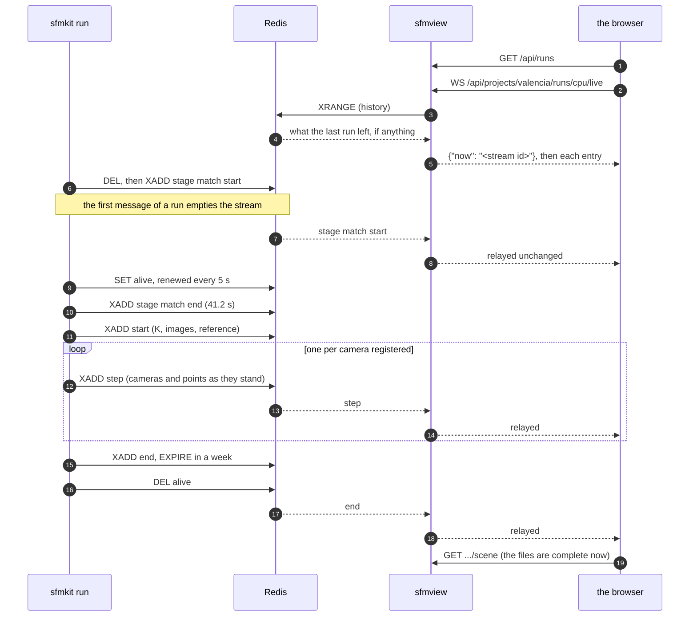

# Live messages

While `reconstruct` works it publishes what it has, step by step, and the
viewer draws it as it arrives. Neither knows the other: sfmkit writes to a
Redis stream, the viewer reads from it, and the message format between them is
a schema both test against — [`sfmcontracts/step.schema.json`](https://json-schema.org/).
A change on one side breaks a test on the other, not a run.

```bash
# sfmkit publishes when this names a Redis
SFMKIT_BROKER=redis://localhost:6379 sfmkit reconstruct --config projects/valencia/configs/cpu.yaml
# the viewer reads when this names the same one
sfmview --projects projects --broker redis://localhost:6379
```

With Docker both are set for you; see [Install with Docker](../install/docker.md#watching-a-run-as-it-is-built).

## How it goes



Nothing in that diagram is a request from one program to the other: sfmkit
writes to Redis and the viewer reads from it, and neither would notice the
other being replaced.

## The keys

| Key | What it is |
|---|---|
| `sfmkit:steps:<project>/<config>` | the stream, one JSON message per entry, in the entry's `data` field |
| `sfmkit:alive:<project>/<config>` | the heartbeat: set while the run works, 15 s expiry, renewed every 5 s |

The stream is named after the run's directory, exactly as the viewer names
runs, so `--out` cannot write into another run's stream. It is trimmed to a
thousand entries — far more than any run's steps — and **emptied by the first
message of a run**, so a repeat replaces its predecessor rather than appending
to it. The first and not the `start`, because a whole run speaks about its
earlier stages before the reconstruction opens, and those would be wiped
mid-run.

A finished run's stream stays, which is what lets its timeline be rewound after
the fact, but not for ever: the `end` (or the `failed`) sets an expiry of a
week on it. A broker that saw many runs and never forgot one would only grow.

The heartbeat is the difference between a run at work and a run that died
without a word: killed outright, sfmkit stops renewing the key and Redis lets
it expire, so the viewer stops calling it live.

## The messages

Five kinds, all carrying `v` (the version, `1`), `kind`, and `run`
(`<project>/<config>`). Poses are world to camera, `x_cam = R X + t`, in
OpenCV's axes; point arrays are flat and finite-only; any number that is not
finite is sent as `null` where the schema allows it.

### `stage`

A stage of a whole run beginning, finishing, or stopping it. Only
`reconstruct` has anything to draw; the rest are silent for minutes at a time,
and a page watching a run should not have to guess whether it is matching or
dead.

```json
{"v": 1, "kind": "stage", "run": "valencia/cpu", "stage": "match",
 "state": "end", "seconds": 41.2, "note": "92 pairs on cuda"}
```

| Field | |
|---|---|
| `stage` | `calibrate`, `match`, `verify`, `reconstruct`, `localize`, `colmap`, `dense`, `evaluate`, `changes` or `figures` |
| `state` | `start`, `end` or `failed` |
| `seconds` | what it took, on `end` or `failed` |
| `note` | a line of its own: why it stopped, or what it did |

Only `sfmkit run` sends these: a single stage invoked on its own is its own
whole run, and says nothing about the others.

### `start`

The run opening: what it will try to register, and with what camera. The stream
is emptied immediately before this is written.

```json
{
  "v": 1, "kind": "start", "run": "valencia/cpu",
  "K": [[3029.0, 0.0, 2016.0], [0.0, 3029.0, 1134.0], [0.0, 0.0, 1.0]],
  "images": ["Img01", "Img02", "Img03"],
  "reference": "Img01"
}
```

`reference` is the camera the finished model will be anchored to. A watcher
needs it to draw the steps where the finished model will sit: until there is
one, it has no transform to take, and would otherwise place the model in the
seed pair's frame and have it jump when the run ends.

### `step`

One per camera registered, and one for the final global refinement, whose
`image` is the string `global refinement` rather than a photograph's name. It
carries the whole model as it stood — the poses of every registered camera and
every triangulated point — so a viewer that arrives late can draw any step
without replaying the ones before it.

```json
{
  "v": 1, "kind": "step", "run": "valencia/cpu",
  "step": 0, "image": "Img14",
  "n_registered": 2, "n_points": 446,
  "rmse_before": null, "rmse_after": 2.22,
  "bundle_seconds": 0.4,
  "cameras": [
    {"name": "Img14", "R": [[1,0,0],[0,1,0],[0,0,1]], "t": [0,0,0]},
    {"name": "Img04", "R": [["…"]], "t": [-1.0, 0.0, 0.0]}
  ],
  "points": [0.1, 0.2, 5.0, -0.3, 0.1, 6.0]
}
```

| Field | |
|---|---|
| `step` | 0 for the seed pair, then one per camera |
| `image` | the camera just added, or `global refinement` |
| `n_registered`, `n_points` | the model's size after this step |
| `rmse_before`, `rmse_after` | reprojection error in pixels, around this step's bundle adjustment; `null` where there is nothing to report |
| `bundle_seconds` | what that bundle adjustment took |
| `cameras` | every registered camera, `name`, `R`, `t` |
| `points` | flat `x y z`, the triangulated points only, at most 20 000 of them |

**A step's points are capped.** Carrying the whole model is what lets any step
be drawn without replaying the ones before it, but it costs steps times points
of the broker's memory, and a step is kept for as long as the stream is. Past
20 000 points sfmkit sends a stride through them instead — the whole model
thinned, not a corner of it — while `n_points` goes on reporting the true
count. Valencia, at 2 830 points, never reaches it; a few hundred cameras would.

### `end`

The run finished, with what it ended up with. For the viewer this also means
the files on disk are now complete, so it refetches them.

```json
{"v": 1, "kind": "end", "run": "valencia/cpu", "n_cameras": 14, "n_points": 2850}
```

### `failed`

The run stopped short, with the reason — an interruption included, so Ctrl-C
leaves a stream that says what happened rather than one that simply stops.

```json
{"v": 1, "kind": "failed", "run": "valencia/cpu", "error": "KeyboardInterrupt"}
```

## The contract, as a file

The message format is [`sfmcontracts/step.schema.json`][schema], which both test
suites validate against — a change on one side breaks a test on the other. What
JSON Schema cannot say is who publishes what, where, and who listens; that is
[`sfmcontracts/asyncapi.yaml`][asyncapi], an AsyncAPI 3 document that names the
two channels (the stream and the heartbeat), the WebSocket the viewer relays
them on, and points each message at the schema rather than repeating it.

  [schema]: https://github.com/dpadillaor/sfmkit/blob/main/packages/contracts/src/sfmcontracts/step.schema.json
  [asyncapi]: https://github.com/dpadillaor/sfmkit/blob/main/packages/contracts/src/sfmcontracts/asyncapi.yaml

It is the same idea as the OpenAPI that FastAPI serves for the HTTP side at
[`/docs`](api.md): the interface written down in the form its tools understand,
so it can be read, diffed and generated from.

## Reading them yourself

The messages are plain JSON on a plain Redis stream, so anything that speaks
Redis can watch a run:

```bash
redis-cli XRANGE sfmkit:steps:valencia/cpu - + COUNT 1
redis-cli EXISTS sfmkit:alive:valencia/cpu     # 1 while the run is at work
```

Or through the viewer, which needs no Redis client of your own:
[`WS /api/runs/{project}/{config}/live`](api.md#ws-apirunsprojectconfigliveafterid).

## When the broker is not there

Publishing never stops a run. Without `SFMKIT_BROKER` sfmkit runs exactly as it
did before any of this existed; if the broker goes away mid-run it says so once
and carries on to the end. The viewer with no `--broker` shows finished runs and
reports `live: null` on `/api/health`.
